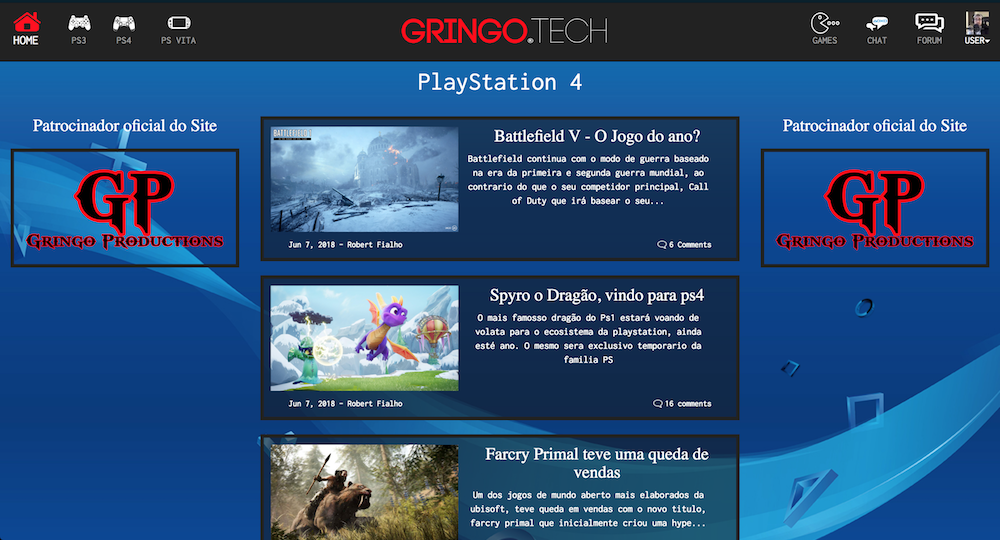
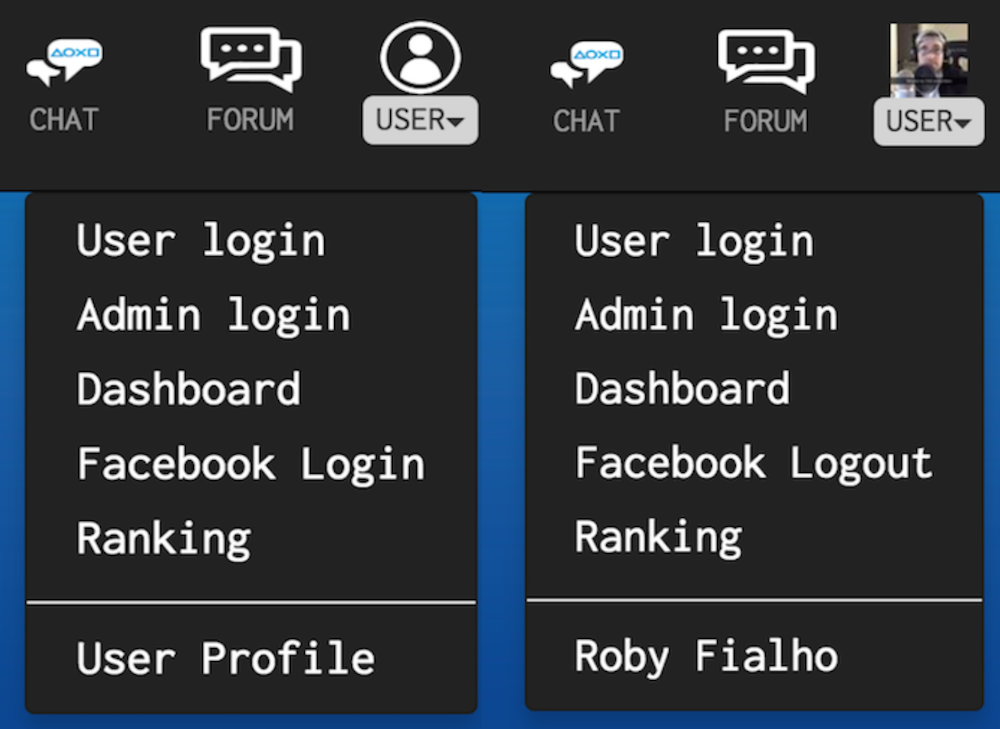

# Gringo.Tech - In Development!
 I created this website in order to display news regarding the playstion ecosystem.
This project was build using the following technologies.
- HTML5
- CSS3
- Javascript
- JQuery
- Bootstrap
- PHP
- Mysql
- Facebook API 
- Disqus API

#### Check The Project :[Click Me](https://gringo.tech)

#### V.4.0 ~ Date: 11/8/2018.

#### Minor Technical Improvements
- Fix issue with the placeholder picture not displaying when user logs out.

#### Minor Visual Improvements
- Facebook profile picture its now being display on the correct location
- Placeholder picture its now being change for the facebook profile picture when user logs in.
- Fix issues with the navbar not displaying correctly when viewing on a smaller screen.

#### V.3.1 ~ Date: 10/09/2018.
#### Minor Technical Improvements.
- User commets was added using the Disqus API
#### Minor Visual Improvements.
- fix a couple of issues regarding media queries.

#### V.3.1 ~ Date: 10/02/2018.
#### Minor Technical Improvements
- Added a contact-us form that takes user input and sends it to my email.

#### V.3.0 ~ Date: 09/25/2018.

#### Major Technical Improvements 
- Website its now connected to its own database via PHP/MySQL.
- User login is beeing store in the database - but there is no authentication.
#### Major Visual Improvements.
- Fixed divs proportion
- 100% responsive
- Added even lines for easy readability

#### V.2.0 ~ Date: 09/19/2018.

#### Major Technical Improvements 
- Switch to PHP in order to use components.
#### Major Visual Improvements.
- overall layout changed 
- added responsive design to an extend!

#### V.1.1 ~ Date: 09/11/2018.
#### Minor Visual Improvements
- added custom shooting stars to enhance visual. 

#### V.1.0 ~ Date: 09/06/2018.
- Project layout 
- Added fake info for display

